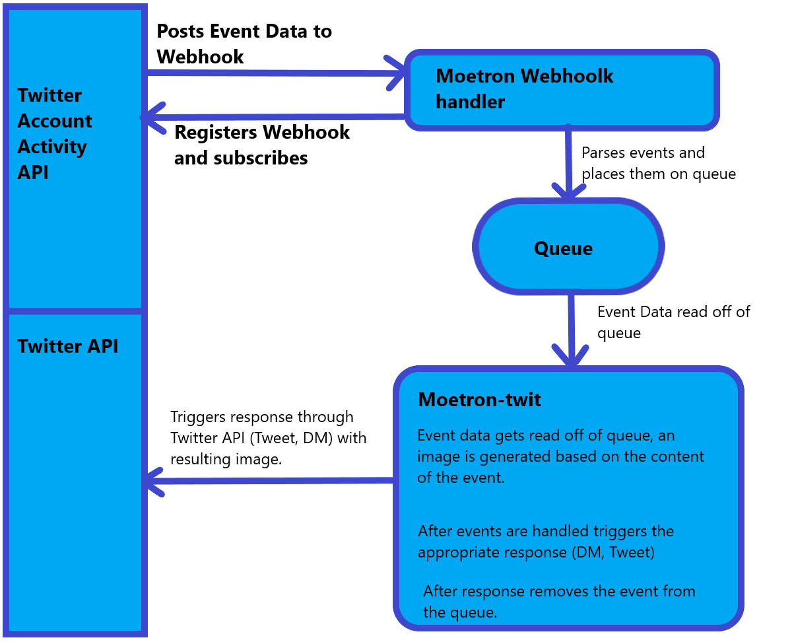

# Twitter Webhook Handler for Moetron

A simple flask app that sets up the webhook w/ twitter and handles incoming events. The events are parsed and only valid events that I want my bot to respond to are placed on the queue. 

Also includes register_hook to register the hook and subscribe.

### Some setup and usage information

Make sure you have Python, 3.7 or newer should work.

Install pre-reqs with `pip install -r requirements.txt`

Set up ENV vars as needed.

Run using `python app.py` to start up the app and register the webhook

Run register_hook.py to register your webhook without starting the app. Note, you'll need to have a twitter dev account and a dev environment set up with twitter.

Make sure wherever you're hosting this is fast enough to handle the CRC check, you need to be able to respond within 3 seconds I believe.

You won't be able to actually get events when running this locally unless using something like ngrok, but you can at least test the queue connection.

### Moetron Architecture:

Here's a simple architecture diagram made in paint. The architecture is pretty simple but more complex than just writing a standalone bot like you can for discord.

There's 3 main parts in play here.

**Webhook handler**
A simple webapp that does a few things. First, it registers the webhook and subscribes to the user's events. Next, it handles events that are posted to it from Twitter. Since we only want tweet events and dm events it ignores all others. It'll check the events and make sure that they're actually commands (ie: contain the keywords for one of the commands that moetron-twit supports) and if they're valid it'll take out the relevant data from the event and place it on the queue. It also handles the CRC check from twitter which gets triggered hourly.

**Queue**
A queue that holds events placed on it by the webhook handler. It holds events until they're read by Moetron, so if moetron has downtime they'll still eventually get read and responded to.

**Moetron**
The gut of the bot that reads the parsed events off of the queue. Based on the text content of the event it'll generate an image for the specific command. Checks whether the event is a DM or tweet and triggers the appropriate response using tweepy. After the response is triggered, it'll remove the event off of the queue.

### Questions

Q) Why don't you just do the handling /replying here?

A) In my scenario the workload that my bot does requires a fairly powerful GPU, so I'd have to pay an exorbiant amount of money to host it as hosting options w/ a GPU are ridiculously expensive. It was much cheaper for me to set up an old PC with a decent GPU to handle the workload. I could have used ngrok or something but I wanted Azure experience so here we are.

Q) Can I reuse this code for my own usage?

A) See LICENSE, it's the MIT license which pretty much lets you do what you want.

